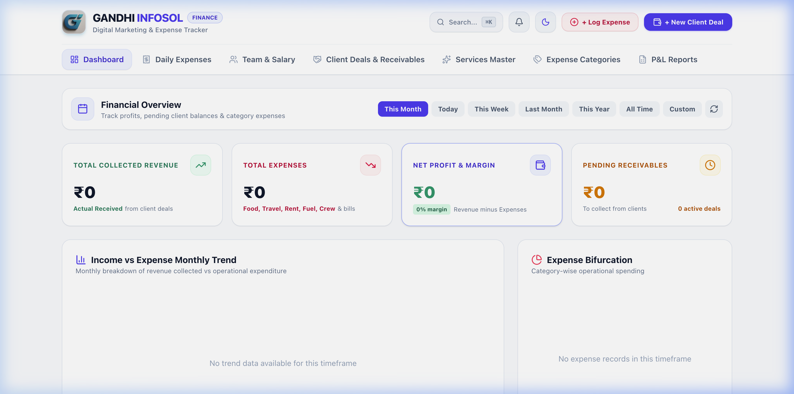
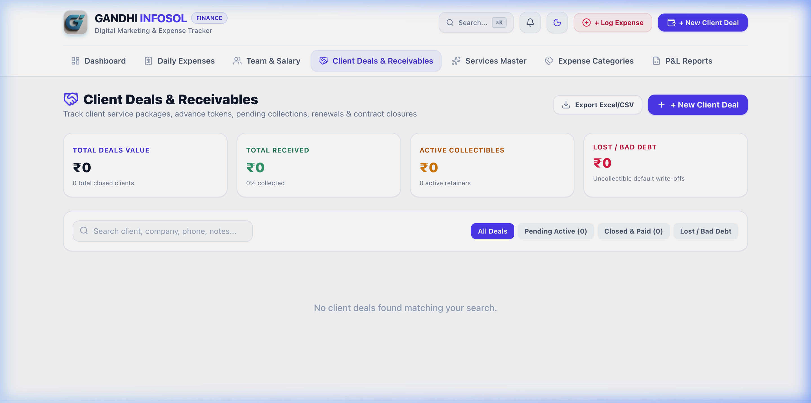
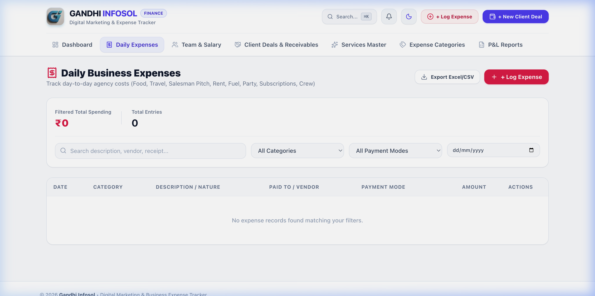
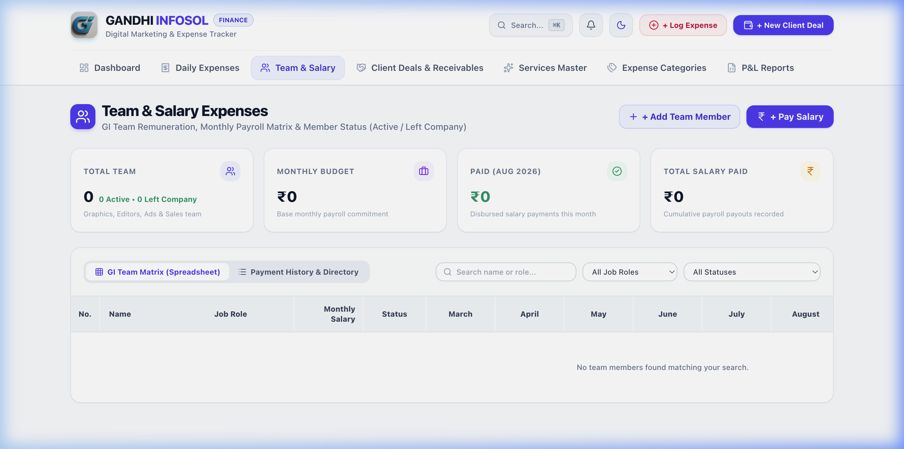

# 💎 ExpenseT - Modern Financial & Expense Management Platform

[](https://react.dev/)
[](https://vitejs.dev/)
[](https://expressjs.com/)
[](https://sqlite.org/)
[](https://tailwindcss.com/)

**ExpenseT** is a sleek, full-stack financial platform designed for businesses, freelancers, and teams to effortlessly track daily expenses, manage client deals & proposals, oversee team salaries, and generate financial reports.

---

## 🌟 Key Features

- **📊 Financial Dashboard & Analytics**: Live tracking of monthly revenue, total expenses, net profit margins, and interactive Recharts data visualizations.
- **💼 Client Deals & Pipeline**: Manage client pipelines, track receivables, stage progress, and generate branded PDF proposals & invoices.
- **💸 Smart Expense Management**: Categorize expenses, filter by date/mode/category, track payment methods, and monitor budget utilization.
- **👥 Salary & Payroll System**: Full payroll management for team members, base salary controls, bonus/deduction tracking, and payment disbursement logs.
- **🏷️ Masters Management**: Centralized master control for custom service rates and dynamic expense categories.
- **🔍 Global Instant Search & Real-Time Alerts**: Search instantly across deals, transactions, and salaries with integrated notification center.

---

## 📸 Screenshots & Preview

### 1. Interactive Dashboard
*Real-time metrics, financial summary, and income vs. expense breakdown charts.*


<br/>

### 2. Client Deals & Receivables Management
*Track deals through sales pipeline stages and generate customizable invoices/proposals.*


<br/>

### 3. Expense Tracker & Category Analytics
*Log operational expenses with date filters, category tags, and payment mode breakdowns.*


<br/>

### 4. Payroll & Salary Management
*Oversee team salaries, monthly disbursements, bonuses, and payment history.*


---

## 🛠️ Tech Stack

### Frontend
- **Framework**: [React 19](https://react.dev/) + [Vite](https://vitejs.dev/)
- **Styling**: [TailwindCSS v4](https://tailwindcss.com/)
- **Icons**: [Lucide React](https://lucide.dev/)
- **Charts**: [Recharts](https://recharts.org/)
- **PDF & Export**: `jspdf`, `html2canvas`, `xlsx`

### Backend
- **Runtime**: [Node.js](https://nodejs.org/) + [Express.js](https://expressjs.com/)
- **Database**: [Better-SQLite3](https://github.com/WiseLibs/better-sqlite3) (high-performance embedded SQL with WAL support)
- **Middleware**: CORS, Morgan logging

---

## 📂 Project Structure

```
ExpenseT/
├── docs/
│   └── screenshots/         # Screenshots for documentation
├── backend/
│   ├── db.js                # SQLite schema initialization & database connection
│   ├── index.js             # Express REST API endpoints & server setup
│   ├── package.json
│   └── database.sqlite      # SQLite database storage (git-ignored)
├── frontend/
│   ├── public/              # Static assets & icons
│   ├── src/
│   │   ├── assets/
│   │   ├── components/      # React UI modules (Dashboard, Deals, Expenses, Salary, Reports)
│   │   ├── utils/           # API handlers and formatters
│   │   ├── App.jsx          # Main application layout & state
│   │   ├── main.jsx         # Entrypoint
│   │   └── index.css        # Tailwind directives & global styling
│   ├── vite.config.js       # Vite server configuration & API proxying
│   └── package.json
├── package.json             # Root package script
└── README.md
```

---

## 🚀 Quick Start Guide

### Prerequisites
Ensure you have **Node.js** (v18 or higher) and **npm** installed on your system.

### 1. Clone the Repository
```bash
git clone https://github.com/AnshGadoya/ExpenseT.git
cd ExpenseT
```

### 2. Start the Backend Server
```bash
cd backend
npm install
npm run dev
```
*The backend server will run on `http://localhost:5050`.*

### 3. Start the Frontend Application
Open a new terminal window:
```bash
cd frontend
npm install
npm run dev
```
*The frontend application will be live at `http://localhost:3000`.*

---

## 🔌 API Reference Overview

| Endpoint | Method | Description |
| :--- | :--- | :--- |
| `/api/expenses` | `GET` / `POST` / `DELETE` | Manage expense entries |
| `/api/deals` | `GET` / `POST` / `PUT` / `DELETE` | Manage client deals & pipeline |
| `/api/salaries` | `GET` / `POST` / `PUT` | Manage employee salary records |
| `/api/services` | `GET` / `POST` / `DELETE` | Master service catalog |
| `/api/categories` | `GET` / `POST` / `DELETE` | Custom expense categories |

---

## 🤝 Contributing

Contributions, issues, and feature requests are welcome! Feel free to check the [Issues](https://github.com/AnshGadoya/ExpenseT/issues) page.

---

## 📄 License

This project is licensed under the MIT License - see the [LICENSE](LICENSE) file for details.
